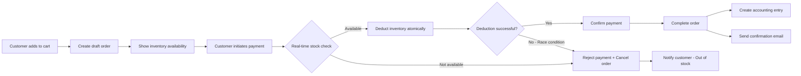
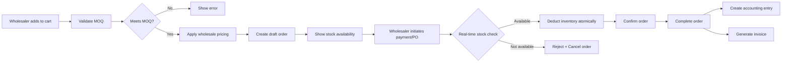
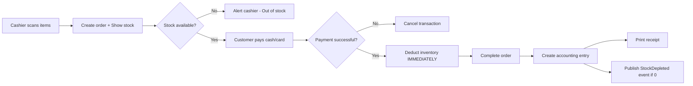

# Microservices Integration Roadmap

This document outlines the step-by-step process for integrating the frontend with four core microservices: **Product Service**, **Inventory Service**, **Accounting Service**, and **Order Service** using Cloudflare Workers, Service Bindings, and event-driven architecture.

## Table of Contents
1. [Architecture Overview](#architecture-overview)
2. [Design Patterns](#design-patterns)
3. [Module 1: Accounting Service](#module-1-accounting-service)
4. [Module 2: Product Service](#module-2-product-service)
5. [Module 3: Inventory Service](#module-3-inventory-service)
6. [Module 4: Order Service](#module-4-order-service)
7. [Inter-Service Communication](#inter-service-communication)
8. [Frontend Integration](#frontend-integration)
9. [Testing Strategy](#testing-strategy)

---

## Architecture Overview

### Microservices Architecture

```
┌──────────────┐  ┌──────────────┐  ┌──────────────┐
│ Retail Web   │  │Wholesale Web │  │   POS App    │
│  (Customer)  │  │ (Wholesaler) │  │ (In-Store)   │
└──────┬───────┘  └──────┬───────┘  └──────┬───────┘
       │                 │                 │
       └─────────────────┼─────────────────┘
                         │ HTTP
                         ▼
              ┌─────────────────────┐
              │   Admin Dashboard   │
              │     (Frontend)      │
              └──────────┬──────────┘
                         │ HTTP
                         ▼
              ┌─────────────────────┐
              │    API Gateway      │◄──────────┐
              │  (Service Router)   │           │
              └──────────┬──────────┘           │
                         │                      │
         ┌───────────────┼───────────┬─────────┐│
         │               │           │         ││
         ▼               ▼           ▼         ▼│
      ┌─────┐        ┌─────┐     ┌─────┐  ┌─────┐
      │Order│───────►│Prod │     │Inv  │  │Acct │
      │ Svc │        │ Svc │     │ Svc │  │ Svc │
      └──┬──┘        └──┬──┘     └──┬──┘  └──┬──┘
         │              │            │        │
         │ Calls via Service Bindings│        │
         └──────────────┴────────────┴────────┘
         │              │            │        │
         ▼              ▼            ▼        ▼
      ┌─────┐        ┌─────┐     ┌─────┐  ┌─────┐
      │ D1  │        │ D1  │     │ D1  │  │ D1  │
      └─────┘        └─────┘     └─────┘  └─────┘
         │              │            │        │
         └──────────────┴────────────┴────────┘
                         │
                         ▼
              ┌─────────────────────┐
              │   Event Queues      │
              │ (Async Communication)│
              └─────────────────────┘
```

### Service Boundaries (Bounded Contexts)

| Service | Responsibility | Database | Events Published |
|---------|---------------|----------|------------------|
| **Order Service** | Order management, 3 sales channels (retail web, wholesale web, POS), order processing | order-db | OrderCreated, OrderConfirmed, OrderCancelled, OrderCompleted |
| **Product Service** | Product catalog, SKUs, pricing, categories | product-db | ProductCreated, ProductUpdated, PriceChanged |
| **Inventory Service** | Stock levels, warehouses, transfers, reservations | inventory-db | StockReserved, StockConfirmed, StockTransferred |
| **Accounting Service** | Chart of accounts, journal entries, financial reports | accounting-db | JournalEntryPosted, AccountCreated |
| **API Gateway** | Route requests, service discovery, aggregation | - | - |

### Sales Channels in Order Service

| Channel | Use Case | Pricing Model | Minimum Order |
|---------|----------|---------------|---------------|
| **Retail Web** | B2C e-commerce via website/mobile app | Retail price | 1 unit |
| **Wholesale Web** | B2B e-commerce for registered wholesalers | Wholesale price (tiered discounts) | Minimum quantity (e.g., 10 units) |
| **Point of Sale (POS)** | In-store retail sales via POS terminal | Retail price | 1 unit |

### Technology Stack

- **Runtime:** Cloudflare Workers
- **Framework:** Hono.js
- **Database:** Cloudflare D1 (SQLite)
- **ORM:** Drizzle ORM
- **Communication:** Service Bindings (synchronous), Queues (asynchronous events)
- **Architecture Patterns:** Hexagonal, DDD, Event-Driven

---

## Design Patterns

### 1. Hexagonal Architecture (Ports & Adapters)

Each service follows the hexagonal architecture:

```
┌─────────────────────────────────────────┐
│           Application Layer              │
│  ┌─────────────────────────────────┐   │
│  │      Domain Layer (Core)        │   │
│  │  - Entities                     │   │
│  │  - Value Objects                │   │
│  │  - Domain Services              │   │
│  │  - Business Rules               │   │
│  └─────────────────────────────────┘   │
│              ▲         │                │
│    ┌─────────┴─┐     ┌─┴────────┐     │
│    │  Input    │     │  Output  │     │
│    │   Ports   │     │   Ports  │     │
│    └─────┬─────┘     └─────┬────┘     │
└──────────┼─────────────────┼───────────┘
           │                 │
    ┌──────┴────────┐   ┌────┴──────┐
    │   Adapters    │   │  Adapters │
    │  - HTTP API   │   │  - D1 DB  │
    │  - Events In  │   │  - Events │
    └───────────────┘   └───────────┘
```

**Folder Structure:**
```
services/[service-name]/
├── src/
│   ├── domain/              # Core business logic
│   │   ├── entities/        # Domain entities
│   │   ├── value-objects/   # Value objects
│   │   ├── repositories/    # Repository interfaces (ports)
│   │   └── services/        # Domain services
│   ├── application/         # Use cases / application services
│   │   ├── commands/        # Command handlers (write)
│   │   ├── queries/         # Query handlers (read)
│   │   └── events/          # Event handlers
│   ├── infrastructure/      # Adapters (external concerns)
│   │   ├── database/        # D1 repository implementations
│   │   ├── http/            # HTTP routes & controllers
│   │   └── events/          # Event publishers/subscribers
│   └── index.ts             # Application entry point
├── migrations/              # Database migrations
└── wrangler.toml            # Cloudflare Workers config
```

### 2. Domain-Driven Design (DDD)

**Ubiquitous Language:** Each bounded context uses domain-specific terminology
- Accounting: Account, JournalEntry, Ledger, FiscalPeriod
- Inventory: Warehouse, Stock, Reservation, Transfer
- Product: SKU, Variant, Catalog, Price

**Aggregates:** Consistency boundaries
- Accounting: `JournalEntry` aggregate (with lines)
- Inventory: `StockReservation` aggregate
- Product: `Product` aggregate (with variants)

### 3. Event-Driven Communication

**Synchronous:** Service Bindings (for immediate consistency)
```typescript
// Example: Order Service calls Inventory Service
const response = await c.env.INVENTORY_SERVICE.fetch(
  new Request('http://internal/api/inventory/reserve', {
    method: 'POST',
    body: JSON.stringify({ productId, quantity })
  })
);
```

**Asynchronous:** Cloudflare Queues (for eventual consistency)
```typescript
// Example: Product Service publishes event
await c.env.PRODUCT_EVENTS_QUEUE.send({
  type: 'ProductCreated',
  data: { productId, sku, name }
});
```

---

## Module 1: Accounting Service

### Phase 1: Service Scaffolding (Steps 1-3)

#### Step 1: Create Service Structure

```bash
mkdir -p services/accounting-service/src/{domain,application,infrastructure}
mkdir -p services/accounting-service/src/domain/{entities,value-objects,repositories,services}
mkdir -p services/accounting-service/src/application/{commands,queries,events}
mkdir -p services/accounting-service/src/infrastructure/{database,http,events}
mkdir -p services/accounting-service/migrations
```

#### Step 2: Define Domain Entities

**File:** `services/accounting-service/src/domain/entities/account.entity.ts`

```typescript
export type AccountType = 'Asset' | 'Liability' | 'Equity' | 'Revenue' | 'COGS' | 'Expense';
export type NormalBalance = 'Debit' | 'Credit';
export type AccountStatus = 'Active' | 'Inactive' | 'Archived';

export class Account {
  constructor(
    public readonly id: string,
    public code: string,
    public name: string,
    public accountType: AccountType,
    public normalBalance: NormalBalance,
    public parentAccountId: string | null,
    public isDetailAccount: boolean,
    public status: AccountStatus,
    public readonly createdAt: Date,
    public updatedAt: Date
  ) {}

  // Domain methods
  activate(): void {
    this.status = 'Active';
    this.updatedAt = new Date();
  }

  deactivate(): void {
    if (!this.isDetailAccount) {
      throw new Error('Cannot deactivate header accounts with children');
    }
    this.status = 'Inactive';
    this.updatedAt = new Date();
  }

  addSubAccount(childAccountId: string): void {
    if (this.isDetailAccount) {
      throw new Error('Detail accounts cannot have sub-accounts');
    }
  }
}
```

**File:** `services/accounting-service/src/domain/entities/journal-entry.entity.ts`

```typescript
import { JournalLine } from './journal-line.entity';

export type EntryStatus = 'Draft' | 'Posted' | 'Voided';
export type EntryType = 'Manual' | 'System' | 'Recurring' | 'Adjusting' | 'Closing';

export class JournalEntry {
  constructor(
    public readonly id: string,
    public readonly entryNumber: string,
    public entryDate: Date,
    public description: string,
    public lines: JournalLine[],
    public status: EntryStatus,
    public entryType: EntryType,
    public readonly createdBy: string,
    public readonly createdAt: Date,
    public updatedAt: Date
  ) {}

  // Domain invariants
  validate(): void {
    if (this.lines.length < 2) {
      throw new Error('Journal entry must have at least 2 lines');
    }

    const totalDebits = this.lines
      .filter(l => l.direction === 'Debit')
      .reduce((sum, l) => sum + l.amount, 0);

    const totalCredits = this.lines
      .filter(l => l.direction === 'Credit')
      .reduce((sum, l) => sum + l.amount, 0);

    if (Math.abs(totalDebits - totalCredits) > 0.01) {
      throw new Error('Debits must equal credits');
    }
  }

  post(postedBy: string): void {
    if (this.status !== 'Draft') {
      throw new Error('Only draft entries can be posted');
    }
    this.validate();
    this.status = 'Posted';
    this.updatedAt = new Date();
  }

  void(voidedBy: string, reason: string): void {
    if (this.status !== 'Posted') {
      throw new Error('Only posted entries can be voided');
    }
    this.status = 'Voided';
    this.updatedAt = new Date();
  }
}
```

#### Step 3: Define Repository Interfaces (Ports)

**File:** `services/accounting-service/src/domain/repositories/account.repository.ts`

```typescript
import { Account } from '../entities/account.entity';

export interface IAccountRepository {
  // Queries
  findAll(): Promise<Account[]>;
  findById(id: string): Promise<Account | null>;
  findByCode(code: string): Promise<Account | null>;
  findByType(accountType: string): Promise<Account[]>;
  findByParentId(parentId: string): Promise<Account[]>;
  findActive(): Promise<Account[]>;

  // Commands
  save(account: Account): Promise<Account>;
  update(account: Account): Promise<Account>;
  delete(id: string): Promise<void>;

  // Domain queries
  hasChildren(id: string): Promise<boolean>;
  hasTransactions(id: string): Promise<boolean>;
}
```

**File:** `services/accounting-service/src/domain/repositories/journal-entry.repository.ts`

```typescript
import { JournalEntry } from '../entities/journal-entry.entity';

export interface IJournalEntryRepository {
  findAll(limit?: number, offset?: number): Promise<JournalEntry[]>;
  findById(id: string): Promise<JournalEntry | null>;
  findByNumber(entryNumber: string): Promise<JournalEntry | null>;
  findByDateRange(from: Date, to: Date): Promise<JournalEntry[]>;
  findByStatus(status: string): Promise<JournalEntry[]>;

  save(entry: JournalEntry): Promise<JournalEntry>;
  update(entry: JournalEntry): Promise<JournalEntry>;

  generateEntryNumber(): Promise<string>;
}
```

### Phase 2: Application Layer (Steps 4-6)

#### Step 4: Implement Commands (Write Operations)

**File:** `services/accounting-service/src/application/commands/create-account.command.ts`

```typescript
import { Account } from '../../domain/entities/account.entity';
import { IAccountRepository } from '../../domain/repositories/account.repository';
import { nanoid } from 'nanoid';

export interface CreateAccountDTO {
  code: string;
  name: string;
  accountType: string;
  normalBalance: string;
  parentAccountId?: string;
  isDetailAccount: boolean;
  description?: string;
}

export class CreateAccountCommand {
  constructor(private accountRepo: IAccountRepository) {}

  async execute(dto: CreateAccountDTO): Promise<Account> {
    // Validation
    const existing = await this.accountRepo.findByCode(dto.code);
    if (existing) {
      throw new Error(`Account with code ${dto.code} already exists`);
    }

    if (dto.parentAccountId) {
      const parent = await this.accountRepo.findById(dto.parentAccountId);
      if (!parent) {
        throw new Error('Parent account not found');
      }
      if (parent.isDetailAccount) {
        throw new Error('Cannot add sub-account to detail account');
      }
    }

    // Create entity
    const account = new Account(
      nanoid(),
      dto.code,
      dto.name,
      dto.accountType as any,
      dto.normalBalance as any,
      dto.parentAccountId || null,
      dto.isDetailAccount,
      'Active',
      new Date(),
      new Date()
    );

    // Persist
    return await this.accountRepo.save(account);
  }
}
```

**File:** `services/accounting-service/src/application/commands/post-journal-entry.command.ts`

```typescript
import { IJournalEntryRepository } from '../../domain/repositories/journal-entry.repository';

export class PostJournalEntryCommand {
  constructor(private entryRepo: IJournalEntryRepository) {}

  async execute(entryId: string, postedBy: string): Promise<void> {
    const entry = await this.entryRepo.findById(entryId);
    if (!entry) {
      throw new Error('Journal entry not found');
    }

    // Domain logic handles validation
    entry.post(postedBy);

    // Persist
    await this.entryRepo.update(entry);

    // Publish event (future)
    // await this.eventBus.publish(new JournalEntryPostedEvent(entry));
  }
}
```

#### Step 5: Implement Queries (Read Operations)

**File:** `services/accounting-service/src/application/queries/get-ledger.query.ts`

```typescript
import { IAccountRepository } from '../../domain/repositories/account.repository';
import { IJournalEntryRepository } from '../../domain/repositories/journal-entry.repository';

export interface LedgerTransaction {
  date: Date;
  entryNumber: string;
  description: string;
  reference?: string;
  direction: 'Debit' | 'Credit';
  amount: number;
  balance: number;
}

export class GetLedgerQuery {
  constructor(
    private accountRepo: IAccountRepository,
    private entryRepo: IJournalEntryRepository
  ) {}

  async execute(
    accountId: string,
    from?: Date,
    to?: Date
  ): Promise<{ account: any; transactions: LedgerTransaction[]; closingBalance: number }> {
    const account = await this.accountRepo.findById(accountId);
    if (!account) {
      throw new Error('Account not found');
    }

    // Fetch journal entries with lines for this account
    // Calculate running balances
    // Return structured data

    return {
      account,
      transactions: [],
      closingBalance: 0,
    };
  }
}
```

#### Step 6: Implement Infrastructure Adapters

**File:** `services/accounting-service/src/infrastructure/database/account.repository.impl.ts`

```typescript
import { DrizzleD1Database } from 'drizzle-orm/d1';
import { IAccountRepository } from '../../domain/repositories/account.repository';
import { Account } from '../../domain/entities/account.entity';
import * as schema from './schema';
import { eq } from 'drizzle-orm';

export class AccountRepositoryImpl implements IAccountRepository {
  constructor(private db: DrizzleD1Database) {}

  async findAll(): Promise<Account[]> {
    const rows = await this.db.select().from(schema.chartOfAccounts).all();
    return rows.map(this.toDomain);
  }

  async findById(id: string): Promise<Account | null> {
    const row = await this.db
      .select()
      .from(schema.chartOfAccounts)
      .where(eq(schema.chartOfAccounts.id, id))
      .get();

    return row ? this.toDomain(row) : null;
  }

  async save(account: Account): Promise<Account> {
    await this.db.insert(schema.chartOfAccounts).values(this.toDatabase(account));
    return account;
  }

  // Mapping methods
  private toDomain(row: any): Account {
    return new Account(
      row.id,
      row.code,
      row.name,
      row.accountType,
      row.normalBalance,
      row.parentAccountId,
      row.isDetailAccount === 1,
      row.status,
      new Date(row.createdAt),
      new Date(row.updatedAt)
    );
  }

  private toDatabase(account: Account): any {
    return {
      id: account.id,
      code: account.code,
      name: account.name,
      accountType: account.accountType,
      normalBalance: account.normalBalance,
      parentAccountId: account.parentAccountId,
      isDetailAccount: account.isDetailAccount ? 1 : 0,
      status: account.status,
      createdAt: account.createdAt.toISOString(),
      updatedAt: account.updatedAt.toISOString(),
    };
  }

  // ... implement other methods
}
```

### Phase 3: HTTP API & Integration (Steps 7-9)

#### Step 7: Create HTTP Routes

**File:** `services/accounting-service/src/infrastructure/http/routes.ts`

```typescript
import { Hono } from 'hono';
import { drizzle } from 'drizzle-orm/d1';
import { AccountRepositoryImpl } from '../database/account.repository.impl';
import { CreateAccountCommand } from '../../application/commands/create-account.command';

type Bindings = {
  DB: D1Database;
  ACCOUNTING_EVENTS_QUEUE: Queue;
};

const app = new Hono<{ Bindings: Bindings }>();

// Health check
app.get('/health', (c) => {
  return c.json({ status: 'healthy', service: 'accounting-service' });
});

// Accounts routes
app.get('/api/accounting/accounts', async (c) => {
  const db = drizzle(c.env.DB);
  const repo = new AccountRepositoryImpl(db);
  const accounts = await repo.findAll();
  return c.json({ accounts });
});

app.post('/api/accounting/accounts', async (c) => {
  const db = drizzle(c.env.DB);
  const repo = new AccountRepositoryImpl(db);
  const command = new CreateAccountCommand(repo);

  const body = await c.req.json();
  const account = await command.execute(body);

  return c.json({ account }, 201);
});

// ... more routes

export default app;
```

#### Step 8: Configure Service

**File:** `services/accounting-service/wrangler.toml`

```toml
name = "accounting-service"
main = "src/index.ts"
compatibility_date = "2024-11-19"

[[d1_databases]]
binding = "DB"
database_name = "accounting-db"
database_id = "your-database-id"

[[queues.producers]]
binding = "ACCOUNTING_EVENTS_QUEUE"
queue = "accounting-events"

# Service bindings (if accounting needs to call other services)
# [[services]]
# binding = "PRODUCT_SERVICE"
# service = "product-service"
```

#### Step 9: Update API Gateway

**File:** `services/api-gateway/src/index.ts`

```typescript
// Add to service bindings
type Bindings = {
  ACCOUNTING_SERVICE: Fetcher;
  PRODUCT_SERVICE: Fetcher;
  INVENTORY_SERVICE: Fetcher;
  // ... other services
};

// Add routing
app.all('/api/accounting/*', async (c) => {
  return c.env.ACCOUNTING_SERVICE.fetch(c.req.raw);
});
```

**File:** `services/api-gateway/wrangler.toml`

```toml
[[services]]
binding = "ACCOUNTING_SERVICE"
service = "accounting-service"
environment = "production"
```

---

## Module 2: Product Service

### Overview
Product Service manages the product catalog, SKUs, variants, pricing, and categories.

### Steps Summary
1. Review existing product-service implementation
2. Refactor to hexagonal architecture if needed
3. Define product domain entities (Product, Variant, Category)
4. Implement product repository
5. Create product commands (CreateProduct, UpdatePrice)
6. Create product queries (SearchProducts, GetProductBySKU)
7. Add HTTP routes
8. Configure service bindings
9. Test integration

### Event Publishing
- `ProductCreated` → Notify inventory to create stock records
- `ProductPriceChanged` → Notify order service of price changes
- `ProductDeleted` → Clean up related records

---

## Module 3: Inventory Service

### Overview
Inventory Service manages warehouses, stock levels, reservations, and transfers.

### Steps Summary
1. Create domain entities (Warehouse, Stock, Reservation, Transfer)
2. Implement repository interfaces
3. Create commands (ReserveStock, TransferStock, AdjustStock)
4. Create queries (GetStockLevel, GetWarehouseStock)
5. Add HTTP routes
6. Configure service bindings with product-service
7. Test integration

### Service Dependencies
- Inventory Service calls Product Service to validate SKUs
- Order Service calls Inventory Service to reserve stock

---

## Module 4: Order Service

### Overview
Order Service manages order processing across three sales channels: **Retail Web**, **Wholesale Web**, and **Point of Sale (POS)**. It orchestrates interactions with Product, Inventory, and Accounting services to complete the order lifecycle.

### Bounded Context

**Ubiquitous Language:**
- **Order**: A customer purchase request
- **Sales Channel**: The origin of the order (Retail Web, Wholesale Web, POS)
- **Order Line Item**: Individual product and quantity in an order
- **Order Status**: Draft → Confirmed → Processing → Completed/Cancelled
- **Pricing Tier**: Retail vs Wholesale pricing rules
- **Minimum Order Quantity (MOQ)**: Required for wholesale orders

**Business Rules:**
1. Retail orders: Any quantity, retail pricing
2. Wholesale orders: Must meet MOQ, tiered pricing applies
3. POS orders: Immediate stock deduction, print receipt
4. **NO inventory reservation** - Real-time inventory only
5. **First-pay-first-served**: Payment confirmation = stock allocation (not order creation)
6. Concurrent stock deduction: If multiple orders try to confirm payment simultaneously, first successful payment gets the stock
7. Auto-cancel pending orders: When stock reaches 0, trigger event to cancel all pending orders for that product
8. Payment confirmation workflow:
   - Check real-time stock availability
   - If available: Deduct stock + confirm order
   - If not available: Reject payment + cancel order
9. Completed orders trigger accounting journal entries

### Domain Model

#### Aggregates

**Order Aggregate (Root)**
```typescript
class Order {
  // Identity
  id: string
  orderNumber: string  // Auto-generated: "ORD-2025-0001"

  // Sales Channel
  salesChannel: 'RetailWeb' | 'WholesaleWeb' | 'POS'

  // Customer info
  customerId: string
  customerEmail: string
  customerName: string

  // Order details
  items: OrderLineItem[]  // Minimum 1 item
  subtotal: Money
  tax: Money
  discount: Money
  total: Money

  // Pricing
  pricingTier: 'Retail' | 'Wholesale'

  // Status
  status: 'Draft' | 'Confirmed' | 'Processing' | 'Completed' | 'Cancelled'

  // Fulfillment
  warehouseId: string
  shippingAddress?: Address
  billingAddress?: Address

  // Metadata
  createdAt: Date
  confirmedAt?: Date
  completedAt?: Date
  cancelledAt?: Date
  cancelReason?: string

  // Domain methods
  addItem(productId: string, quantity: number, price: Money): void
  removeItem(itemId: string): void
  calculateTotal(): void
  confirmPayment(userId: string): Promise<boolean>  // Check stock + deduct if available
  cancel(userId: string, reason: string): void
  complete(userId: string): void  // Create accounting entries

  // Validation
  canBePaid(): boolean  // Check if order is in valid state for payment
}

class OrderLineItem {
  id: string
  productId: string
  productName: string
  sku: string
  quantity: number
  unitPrice: Money
  lineTotal: Money
  taxAmount: Money
}
```

**Value Objects**
```typescript
class Address {
  street: string
  city: string
  state: string
  postalCode: string
  country: string
}

class Money {
  amount: number
  currency: string
}
```

### Architecture Layers

Following hexagonal architecture:

```
src/
├── domain/
│   ├── entities/
│   │   ├── order.entity.ts
│   │   └── order-line-item.entity.ts
│   ├── value-objects/
│   │   ├── money.vo.ts
│   │   └── address.vo.ts
│   ├── repositories/
│   │   └── order.repository.ts
│   └── services/
│       ├── order.service.ts
│       ├── pricing.service.ts          # Calculate prices based on tier
│       └── order-orchestrator.service.ts  # Coordinate with other services
├── application/
│   ├── commands/
│   │   ├── create-order.command.ts
│   │   ├── confirm-order.command.ts
│   │   ├── cancel-order.command.ts
│   │   └── complete-order.command.ts
│   ├── queries/
│   │   ├── get-order.query.ts
│   │   ├── list-orders.query.ts
│   │   └── get-orders-by-customer.query.ts
│   └── dtos/
│       └── order.dto.ts
└── infrastructure/
    ├── database/
    │   ├── schema.ts
    │   └── order.repository.impl.ts
    ├── http/
    │   ├── routes.ts
    │   └── controllers/
    │       ├── retail-order.controller.ts
    │       ├── wholesale-order.controller.ts
    │       └── pos-order.controller.ts
    └── events/
        ├── event-publisher.ts
        └── events/
            ├── order-created.event.ts
            ├── order-confirmed.event.ts
            └── order-completed.event.ts
```

### Order Workflow

#### 1. Retail Web Order Flow (First-Pay-First-Served)



**Key Points:**
- No reservation - stock is only checked and deducted at payment time
- Atomic stock deduction prevents overselling
- Race condition handling: If 2 customers pay simultaneously for last item, first transaction wins
- Pending orders can be cancelled by `StockDepleted` event from other channels

#### 2. Wholesale Web Order Flow (First-Pay-First-Served)



**Key Points:**
- Same real-time inventory model as retail
- MOQ validation happens before order creation
- Payment/PO confirmation triggers stock deduction
- Wholesale orders compete with retail/POS for same inventory pool

#### 3. POS Order Flow (Immediate - Highest Priority)



**Key Points:**
- **Highest priority** - POS gets stock first (immediate payment)
- Stock deduction happens immediately on payment confirmation
- If stock goes to 0, `StockDepleted` event triggers cancellation of pending online orders
- No draft/pending state - order is completed in single transaction
- Real-time inventory sync across all channels

### Service Integration

**Order Service calls other services:**

#### 1. Product Service (Validate Products & Get Prices)
```typescript
// GET product details
const product = await c.env.PRODUCT_SERVICE.fetch(
  new Request(`http://internal/api/products/${productId}`)
);

// Validate product exists and is active
// Get current price based on pricing tier
```

#### 2. Inventory Service (Real-Time Stock Check & Atomic Deduction)

**NO RESERVATION - First-pay-first-served model**

```typescript
// Step 1: Check real-time stock availability (during payment initiation)
const stockCheck = await c.env.INVENTORY_SERVICE.fetch(
  new Request('http://internal/api/inventory/check-availability', {
    method: 'POST',
    body: JSON.stringify({
      warehouseId: order.warehouseId,
      items: order.items.map(item => ({
        productId: item.productId,
        quantity: item.quantity
      }))
    })
  })
);

const availability = await stockCheck.json();
if (!availability.available) {
  throw new Error('Insufficient stock');
}

// Step 2: Atomic stock deduction (during payment confirmation)
// This uses database transaction to prevent race conditions
const deductResponse = await c.env.INVENTORY_SERVICE.fetch(
  new Request('http://internal/api/inventory/deduct', {
    method: 'POST',
    body: JSON.stringify({
      orderId: order.id,
      warehouseId: order.warehouseId,
      items: order.items.map(item => ({
        productId: item.productId,
        quantity: item.quantity
      }))
    })
  })
);

if (!deductResponse.ok) {
  // Race condition: Stock was depleted between check and deduct
  throw new Error('Stock no longer available (sold to another customer)');
}

const deductResult = await deductResponse.json();

// If stock reaches 0 or low threshold, event is auto-published
// Event: StockDepleted { productId, warehouseId }
```

**Inventory Service Implementation (Atomic Deduction):**
```typescript
// In inventory-service
async deductStock(warehouseId: string, productId: string, quantity: number) {
  return await db.transaction(async (tx) => {
    // Lock row for update (prevents concurrent modifications)
    const stock = await tx
      .select()
      .from(warehouseStock)
      .where(
        and(
          eq(warehouseStock.warehouseId, warehouseId),
          eq(warehouseStock.productId, productId)
        )
      )
      .for('update')  // Row-level lock
      .get();

    if (!stock || stock.quantity < quantity) {
      throw new Error('Insufficient stock');
    }

    // Deduct stock
    await tx
      .update(warehouseStock)
      .set({ quantity: stock.quantity - quantity })
      .where(eq(warehouseStock.id, stock.id));

    // Check if stock depleted
    if (stock.quantity - quantity === 0) {
      // Publish StockDepleted event
      await publishEvent({
        type: 'StockDepleted',
        data: { warehouseId, productId }
      });
    }

    return { success: true, remainingStock: stock.quantity - quantity };
  });
}
```

#### 3. Accounting Service (Create Journal Entries)
```typescript
// When order is completed, create accounting entry
// Debit: Accounts Receivable (or Cash for POS)
// Credit: Revenue

await c.env.ACCOUNTING_SERVICE.fetch(
  new Request('http://internal/api/accounting/journal-entries', {
    method: 'POST',
    body: JSON.stringify({
      entryDate: new Date().toISOString(),
      description: `Sales - Order ${order.orderNumber}`,
      reference: order.orderNumber,
      entryType: 'System',
      lines: [
        {
          accountId: cashAccountId,  // or AR account
          direction: 'Debit',
          amount: order.total.amount
        },
        {
          accountId: revenueAccountId,
          direction: 'Credit',
          amount: order.total.amount
        }
      ]
    })
  })
);
```

### API Endpoints

#### Retail Web Orders
```
POST   /api/orders/retail              # Create retail order
GET    /api/orders/retail/:id          # Get retail order
PUT    /api/orders/retail/:id          # Update draft order
POST   /api/orders/retail/:id/confirm  # Confirm order (reserve stock)
POST   /api/orders/retail/:id/cancel   # Cancel order (release stock)
GET    /api/orders/retail              # List retail orders
```

#### Wholesale Web Orders
```
POST   /api/orders/wholesale              # Create wholesale order
GET    /api/orders/wholesale/:id          # Get wholesale order
PUT    /api/orders/wholesale/:id          # Update draft order
POST   /api/orders/wholesale/:id/confirm  # Confirm order
POST   /api/orders/wholesale/:id/cancel   # Cancel order
GET    /api/orders/wholesale              # List wholesale orders
GET    /api/orders/wholesale/customer/:customerId  # Orders by customer
```

#### POS Orders
```
POST   /api/orders/pos                 # Create POS order (immediate)
GET    /api/orders/pos/:id             # Get POS order
GET    /api/orders/pos                 # List POS orders (by store/terminal)
POST   /api/orders/pos/:id/receipt     # Generate receipt
```

### Events Published & Consumed

#### Events Published by Order Service

##### 1. OrderCreated
```json
{
  "type": "OrderCreated",
  "timestamp": "2025-01-15T10:30:00Z",
  "data": {
    "orderId": "order-123",
    "orderNumber": "ORD-2025-0001",
    "salesChannel": "RetailWeb",
    "customerId": "cust-456",
    "total": 1500.00,
    "items": [
      { "productId": "prod-789", "quantity": 2, "price": 750.00 }
    ],
    "status": "PendingPayment"
  }
}
```

##### 2. PaymentConfirmed
```json
{
  "type": "PaymentConfirmed",
  "timestamp": "2025-01-15T10:31:00Z",
  "data": {
    "orderId": "order-123",
    "paymentMethod": "CreditCard",
    "amount": 1500.00
  }
}
```

##### 3. OrderCompleted
```json
{
  "type": "OrderCompleted",
  "timestamp": "2025-01-15T10:35:00Z",
  "data": {
    "orderId": "order-123",
    "orderNumber": "ORD-2025-0001",
    "salesChannel": "RetailWeb",
    "total": 1500.00,
    "journalEntryId": "je-456"  // Created accounting entry
  }
}
```

**This event triggers:**
- Accounting Service: Create journal entry (if not already done)
- Email Service: Send confirmation email
- Analytics Service: Record sale

##### 4. OrderCancelled
```json
{
  "type": "OrderCancelled",
  "timestamp": "2025-01-15T10:32:00Z",
  "data": {
    "orderId": "order-123",
    "orderNumber": "ORD-2025-0001",
    "reason": "Stock depleted - sold to another customer",
    "autoCancel": true
  }
}
```

#### Events Consumed by Order Service

##### StockDepleted (from Inventory Service)
```json
{
  "type": "StockDepleted",
  "timestamp": "2025-01-15T10:31:30Z",
  "data": {
    "warehouseId": "wh-001",
    "productId": "prod-789",
    "previousQuantity": 2,
    "currentQuantity": 0,
    "depletedBy": "POS"  // Which channel caused depletion
  }
}
```

**Order Service Handler:**
```typescript
// Queue consumer in order-service
async function handleStockDepletedEvent(event: StockDepletedEvent) {
  // Find all pending orders for this product in this warehouse
  const pendingOrders = await db
    .select()
    .from(orders)
    .where(
      and(
        eq(orders.warehouseId, event.data.warehouseId),
        eq(orders.status, 'PendingPayment')
      )
    );

  // Filter orders containing the depleted product
  const affectedOrders = pendingOrders.filter(order =>
    order.items.some(item => item.productId === event.data.productId)
  );

  // Auto-cancel these orders
  for (const order of affectedOrders) {
    await cancelOrder(order.id, {
      reason: `Stock depleted - ${event.data.productId} sold out in ${event.data.warehouseId}`,
      autoCancel: true,
      causedBy: event.data.depletedBy
    });

    // Notify customer
    await notifyCustomer(order.customerId, {
      type: 'OrderCancelled',
      message: 'Sorry, the product in your cart is no longer available.'
    });
  }
}
```

**Example Scenario:**
1. Customer A creates online retail order for 2 mobile toys (status: PendingPayment)
2. Customer B comes to POS and buys same 2 mobile toys (immediate payment)
3. POS payment confirmed → Inventory deducted → Stock becomes 0
4. Inventory Service publishes `StockDepleted` event
5. Order Service consumes event → Auto-cancels Customer A's pending order
6. Customer A receives notification: "Product no longer available"

### Steps Summary

1. ✅ Review existing order-service scaffolding
2. ✅ Design domain entities (Order, OrderLineItem)
3. ✅ Implement value objects (Address, Money)
4. ✅ Create repository interfaces
5. ✅ Implement order orchestrator service (coordinates with other services)
6. ✅ Implement pricing service (retail vs wholesale)
7. ✅ Create commands (CreateOrder, ConfirmOrder, CompleteOrder)
8. ✅ Create queries (GetOrder, ListOrders)
9. ✅ Add HTTP controllers for each sales channel
10. ✅ Configure service bindings (Product, Inventory, Accounting)
11. ✅ Implement event publishing
12. ✅ Test order flow for each channel
13. ✅ Test rollback scenarios (order cancellation)

### Channel-Specific Features

#### Retail Web
- Shopping cart persistence
- Guest checkout support
- Shipping address validation
- Multiple payment methods
- Email confirmations

#### Wholesale Web
- MOQ validation
- Tiered pricing (volume discounts)
- Credit limit checks
- Purchase order numbers
- Invoice generation
- Net payment terms (e.g., Net 30)

#### Point of Sale (POS)
- Barcode scanning
- Immediate inventory deduction
- Cash/card payment
- Receipt printing
- Offline mode support (sync later)
- Cashier assignment

### Database Schema

```sql
-- Orders table
CREATE TABLE orders (
  id TEXT PRIMARY KEY,
  order_number TEXT UNIQUE NOT NULL,
  sales_channel TEXT NOT NULL,  -- 'RetailWeb', 'WholesaleWeb', 'POS'
  customer_id TEXT NOT NULL,
  customer_email TEXT,
  customer_name TEXT NOT NULL,

  pricing_tier TEXT NOT NULL,  -- 'Retail', 'Wholesale'
  warehouse_id TEXT NOT NULL,

  subtotal REAL NOT NULL,
  tax REAL NOT NULL,
  discount REAL NOT NULL,
  total REAL NOT NULL,
  currency TEXT DEFAULT 'USD',

  status TEXT NOT NULL,  -- 'PendingPayment', 'PaymentConfirmed', 'Completed', 'Cancelled'

  shipping_address_json TEXT,  -- JSON serialized address
  billing_address_json TEXT,

  created_at INTEGER NOT NULL,
  payment_confirmed_at INTEGER,  -- When payment was confirmed
  completed_at INTEGER,
  cancelled_at INTEGER,
  cancel_reason TEXT,
  auto_cancelled INTEGER DEFAULT 0,  -- 1 if cancelled by system (stock depletion)

  created_by TEXT,
  metadata TEXT  -- JSON for channel-specific data
);

-- Order line items table
CREATE TABLE order_line_items (
  id TEXT PRIMARY KEY,
  order_id TEXT NOT NULL,
  product_id TEXT NOT NULL,
  product_name TEXT NOT NULL,
  sku TEXT NOT NULL,
  quantity INTEGER NOT NULL,
  unit_price REAL NOT NULL,
  line_total REAL NOT NULL,
  tax_amount REAL NOT NULL,

  FOREIGN KEY (order_id) REFERENCES orders(id)
);

-- Payment history (tracks payment attempts)
CREATE TABLE order_payments (
  id TEXT PRIMARY KEY,
  order_id TEXT NOT NULL,
  payment_method TEXT NOT NULL,  -- 'CreditCard', 'Cash', 'BankTransfer', etc.
  amount REAL NOT NULL,
  currency TEXT DEFAULT 'USD',
  status TEXT NOT NULL,  -- 'Pending', 'Confirmed', 'Failed'
  transaction_id TEXT,  -- External payment gateway transaction ID
  failed_reason TEXT,  -- If payment failed
  created_at INTEGER NOT NULL,

  FOREIGN KEY (order_id) REFERENCES orders(id)
);

-- Indexes for performance
CREATE INDEX idx_orders_status ON orders(status);
CREATE INDEX idx_orders_warehouse_product ON orders(warehouse_id, status);
CREATE INDEX idx_orders_customer ON orders(customer_id);
CREATE INDEX idx_orders_sales_channel ON orders(sales_channel, status);
```

**Key Differences from Reservation Model:**
- ❌ No `order_reservations` table (no reservation needed)
- ✅ Order status: `PendingPayment` → `PaymentConfirmed` → `Completed`
- ✅ `payment_confirmed_at` tracks when payment succeeded (triggers stock deduction)
- ✅ `auto_cancelled` flag indicates system auto-cancel (from StockDepleted event)
- ✅ `order_payments` table tracks all payment attempts

---

## Inter-Service Communication

### Synchronous Calls (Service Bindings)

**Example: Order Service reserves inventory**

```typescript
// In order-service
const reservationResponse = await c.env.INVENTORY_SERVICE.fetch(
  new Request('http://internal/api/inventory/reserve', {
    method: 'POST',
    headers: { 'Content-Type': 'application/json' },
    body: JSON.stringify({
      productId: 'prod-123',
      quantity: 10,
      orderId: 'order-456'
    })
  })
);

if (!reservationResponse.ok) {
  throw new Error('Failed to reserve inventory');
}
```

### Asynchronous Events (Cloudflare Queues)

**Publishing Events:**

```typescript
// In product-service
await c.env.PRODUCT_EVENTS_QUEUE.send({
  type: 'ProductCreated',
  timestamp: new Date().toISOString(),
  data: {
    productId: product.id,
    sku: product.sku,
    name: product.name
  }
});
```

**Consuming Events:**

```typescript
// In inventory-service (queue consumer)
export default {
  async queue(batch: MessageBatch, env: Env): Promise<void> {
    for (const message of batch.messages) {
      const event = message.body;

      if (event.type === 'ProductCreated') {
        // Create initial stock records for all warehouses
        await createInitialStock(event.data.productId);
      }

      message.ack();
    }
  }
};
```

---

## Frontend Integration

### Update API Client

**File:** `apps/admin-dashboard/src/lib/api.ts`

```typescript
// Base URL points to API Gateway
const API_BASE_URL = import.meta.env.VITE_API_BASE_URL || 'http://localhost:8787';

// All requests go through gateway, which routes to services
export const accountingApi = {
  accounts: {
    getAll: () => apiRequest('/api/accounting/accounts'),
    create: (data: any) => apiRequest('/api/accounting/accounts', {
      method: 'POST',
      body: JSON.stringify(data)
    })
  }
};

export const productApi = {
  getAll: () => apiRequest('/api/products'),
  create: (data: any) => apiRequest('/api/products', {
    method: 'POST',
    body: JSON.stringify(data)
  })
};

export const inventoryApi = {
  getStock: (productId: string) => apiRequest(`/api/inventory/${productId}`),
  reserve: (data: any) => apiRequest('/api/inventory/reserve', {
    method: 'POST',
    body: JSON.stringify(data)
  })
};
```

### Environment Configuration

**File:** `apps/admin-dashboard/.env`

```env
# Points to API Gateway (single entry point)
VITE_API_BASE_URL=http://localhost:8787
```

---

## Testing Strategy

### 1. Unit Tests (Domain Layer)
```typescript
describe('JournalEntry', () => {
  it('should validate debits equal credits', () => {
    const entry = new JournalEntry(/* ... */);
    expect(() => entry.validate()).not.toThrow();
  });
});
```

### 2. Integration Tests (Service Layer)
```bash
# Test each service independently
cd services/accounting-service
wrangler dev --local

curl http://localhost:8787/api/accounting/accounts
```

### 3. End-to-End Tests
```bash
# Start all services
cd services/api-gateway && wrangler dev --port 8787
cd services/accounting-service && wrangler dev --port 8788
cd services/product-service && wrangler dev --port 8789

# Test through gateway
curl http://localhost:8787/api/accounting/accounts
```

---

## Deployment Checklist

- [ ] All services have wrangler.toml configured
- [ ] Database migrations applied for each service
- [ ] Service bindings configured in API gateway
- [ ] Environment variables set
- [ ] Queue consumers deployed
- [ ] Frontend points to API gateway URL
- [ ] Health checks passing for all services

---

## Resources

- [Cloudflare Workers Documentation](https://developers.cloudflare.com/workers/)
- [Service Bindings Guide](https://developers.cloudflare.com/workers/runtime-apis/bindings/service-bindings/)
- [Cloudflare Queues](https://developers.cloudflare.com/queues/)
- [Hexagonal Architecture](https://alistair.cockburn.us/hexagonal-architecture/)
- [Domain-Driven Design](https://martinfowler.com/tags/domain%20driven%20design.html)
