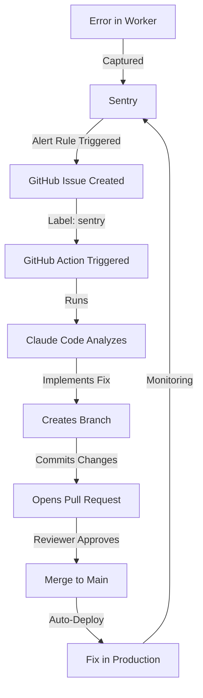

# GitHub + Claude Code + Sentry Integration Guide

**Automated Error Monitoring and Issue Resolution for Kidkazz Platform**

This guide explains how to integrate Sentry (error monitoring), GitHub (issue tracking), and Claude Code (automated fixing) to create an automated workflow for detecting and resolving issues in the Kidkazz dual-market e-commerce platform.

## 📋 Table of Contents

1. [Overview](#overview)
2. [Architecture](#architecture)
3. [Prerequisites](#prerequisites)
4. [Part 1: Sentry Setup for Cloudflare Workers](#part-1-sentry-setup-for-cloudflare-workers)
5. [Part 2: GitHub Integration with Sentry](#part-2-github-integration-with-sentry)
6. [Part 3: Claude Code GitHub Integration](#part-3-claude-code-github-integration)
7. [Part 4: Automated Workflow](#part-4-automated-workflow)
8. [Configuration Examples](#configuration-examples)
9. [Best Practices](#best-practices)
10. [Troubleshooting](#troubleshooting)

---

## Overview

This integration creates an automated error detection and resolution pipeline:

```
Error occurs → Sentry detects → GitHub issue created → Claude Code notified → Fix implemented → PR created
```

### Benefits

- **Automated Error Detection**: Sentry monitors all microservices in real-time
- **Instant Issue Creation**: Errors automatically create GitHub issues with full context
- **AI-Powered Fixes**: Claude Code analyzes and implements fixes automatically
- **Reduced MTTR**: Mean Time To Resolution drops from hours/days to minutes
- **24/7 Monitoring**: Works continuously without human intervention
- **Cost Effective**: Minimal overhead on Cloudflare's serverless platform

---

## Architecture

### Current Kidkazz Architecture

```
kidkazz/
├── services/                 # 5 Microservices
│   ├── api-gateway/          # Entry point (Hono)
│   ├── product-service/      # Product management
│   ├── order-service/        # Order orchestration
│   ├── payment-service/      # Xendit integration
│   ├── user-service/         # Authentication
│   └── inventory-service/    # Warehouse management
├── apps/
│   └── admin-dashboard/      # Admin UI (TanStack Start)
└── shared/                   # Shared libraries
```

### Integration Architecture

```
┌─────────────────────────────────────────────────────────────┐
│                    Cloudflare Workers                        │
│  ┌──────────┐  ┌──────────┐  ┌──────────┐  ┌──────────┐   │
│  │ Gateway  │  │ Product  │  │  Order   │  │ Payment  │   │
│  │ Service  │  │ Service  │  │ Service  │  │ Service  │   │
│  └────┬─────┘  └────┬─────┘  └────┬─────┘  └────┬─────┘   │
│       │             │              │             │          │
│       └─────────────┴──────────────┴─────────────┘          │
│                         │                                    │
│                    Sentry SDK                                │
└─────────────────────────┬───────────────────────────────────┘
                          │
                    ┌─────▼─────┐
                    │   Sentry  │
                    │  Platform │
                    └─────┬─────┘
                          │
                    GitHub Issue Created
                          │
                    ┌─────▼─────┐
                    │   GitHub  │
                    │   Repo    │
                    └─────┬─────┘
                          │
                    @claude mention
                          │
                    ┌─────▼─────┐
                    │   Claude  │
                    │    Code   │
                    └─────┬─────┘
                          │
                    Fix Implemented + PR
```

---

## Prerequisites

### Required Accounts

1. **Sentry Account**
   - Sign up at [sentry.io](https://sentry.io)
   - Free tier available (5K errors/month)
   - Team/Business plan recommended for full GitHub integration

2. **GitHub Account**
   - Repository access for kidkazz
   - Admin permissions to install GitHub Apps

3. **Claude Code Access**
   - Claude Pro or Team subscription
   - Access to Claude Code on web or CLI

4. **Cloudflare Account**
   - Existing Workers deployment
   - Access to wrangler CLI

### Required Tools

```bash
# Node.js 20+
node --version

# pnpm package manager
pnpm --version

# Wrangler CLI
wrangler --version

# GitHub CLI (optional but helpful)
gh --version
```

---

## Part 1: Sentry Setup for Cloudflare Workers

### Step 1.1: Create Sentry Project

1. Go to [sentry.io](https://sentry.io) and create a new project
2. Select **Cloudflare Workers** as the platform
3. Name it `kidkazz-platform`
4. Copy your **DSN** (Data Source Name)

### Step 1.2: Install Sentry SDK

Install the official Sentry SDK for Cloudflare:

```bash
# Navigate to your project root
cd /home/user/kidkazz

# Install Sentry for all services
pnpm add @sentry/cloudflare -w

# Install for each service individually (if needed)
cd services/api-gateway
pnpm add @sentry/cloudflare

cd ../product-service
pnpm add @sentry/cloudflare

# Repeat for other services...
```

### Step 1.3: Configure Compatibility Flags

Update each service's `wrangler.jsonc` to enable AsyncLocalStorage:

**Example: `services/api-gateway/wrangler.jsonc`**

```jsonc
{
  "name": "api-gateway",
  "main": "src/index.ts",
  "compatibility_date": "2025-11-29",
  "compatibility_flags": ["nodejs_compat"], // Add this line
  "vars": {
    "ENVIRONMENT": "production"
  },
  "observability": {
    "enabled": true,
    "head_sampling_rate": 1
  }
}
```

Repeat for all services:
- `services/product-service/wrangler.jsonc`
- `services/order-service/wrangler.jsonc`
- `services/payment-service/wrangler.jsonc`
- `services/user-service/wrangler.jsonc`
- `services/inventory-service/wrangler.jsonc`

### Step 1.4: Add Sentry Secrets

Add your Sentry DSN as a secret (don't commit to git):

```bash
# For each service
cd services/api-gateway
echo 'SENTRY_DSN="https://[YOUR_KEY]@[YOUR_ORG].ingest.sentry.io/[PROJECT_ID]"' >> .dev.vars

# For production (run for each service)
wrangler secret put SENTRY_DSN
# Paste your DSN when prompted
```

### Step 1.5: Integrate Sentry with Hono

Update your API Gateway to use Sentry:

**Example: `services/api-gateway/src/index.ts`**

```typescript
import { Hono } from 'hono';
import * as Sentry from '@sentry/cloudflare';

// Define your environment type
interface Env {
  SENTRY_DSN: string;
  ENVIRONMENT: string;
  // ... other bindings
}

const app = new Hono<{ Bindings: Env }>();

// Your existing routes
app.get('/health', (c) => {
  return c.json({ status: 'ok', service: 'api-gateway' });
});

app.get('/api/admin/dashboard/stats', (c) => {
  // Your admin logic
  return c.json({ /* stats */ });
});

// ... more routes

// Wrap the app with Sentry
export default Sentry.withSentry(
  (env: Env) => ({
    dsn: env.SENTRY_DSN,
    environment: env.ENVIRONMENT || 'development',
    tracesSampleRate: 1.0, // 100% of transactions for tracing
    beforeSend(event) {
      // Filter out certain errors if needed
      return event;
    },
  }),
  app
);
```

**Repeat for each microservice:**

1. **Product Service** (`services/product-service/src/index.ts`)
2. **Order Service** (`services/order-service/src/index.ts`)
3. **Payment Service** (`services/payment-service/src/index.ts`)
4. **User Service** (`services/user-service/src/index.ts`)
5. **Inventory Service** (`services/inventory-service/src/index.ts`)

### Step 1.6: Custom Error Capturing

For more control over error reporting:

```typescript
import * as Sentry from '@sentry/cloudflare';

app.post('/api/orders', async (c) => {
  try {
    // Your order creation logic
    const order = await createOrder(data);
    return c.json(order, 201);
  } catch (error) {
    // Capture error with additional context
    Sentry.captureException(error, {
      tags: {
        service: 'order-service',
        endpoint: '/api/orders',
      },
      extra: {
        orderId: data.orderId,
        userId: data.userId,
      },
    });

    return c.json({ error: 'Failed to create order' }, 500);
  }
});
```

### Step 1.7: Test Sentry Integration

Create a test error endpoint:

```typescript
app.get('/api/test-sentry', (c) => {
  throw new Error('Test error for Sentry integration');
});
```

Deploy and test:

```bash
cd services/api-gateway
pnpm deploy

# Test the endpoint
curl https://api-gateway.your-subdomain.workers.dev/api/test-sentry
```

Check your Sentry dashboard - you should see the error appear within seconds.

---

## Part 2: GitHub Integration with Sentry

### Step 2.1: Install Sentry GitHub App

1. Go to your Sentry project
2. Navigate to **Settings** → **Integrations**
3. Find **GitHub** and click **Install**
4. Authorize Sentry to access your GitHub organization
5. Select the `kidkazz` repository

### Step 2.2: Configure Issue Sync

1. In Sentry, go to **Settings** → **Integrations** → **GitHub**
2. Click **Configure**
3. Enable **Issue Sync**
4. Configure sync settings:
   ```
   ✅ Create GitHub issues for new Sentry issues
   ✅ Link Sentry issues to existing GitHub issues
   ✅ Sync issue status (resolved/unresolved)
   ✅ Sync assignees
   ```

### Step 2.3: Set Up Issue Rules

Configure when to create GitHub issues:

1. Go to **Settings** → **Alerts**
2. Create a new alert rule:

**Rule Configuration:**
```yaml
Name: "Auto-create GitHub Issue for Critical Errors"
Conditions:
  - Event level is: Error or Fatal
  - Event is seen more than: 5 times in 1 hour
  - OR Event affects more than: 10 users
Actions:
  - Create a new issue in GitHub repository: kidkazz
  - Assign to: @your-team or specific developer
  - Add label: "sentry", "bug", "automated"
```

### Step 2.4: Customize Issue Templates

Sentry automatically creates issues with:
- Error title and message
- Stack trace
- Environment (production/development)
- Number of affected users
- Frequency
- First seen / Last seen timestamps

You can customize the issue body in Sentry settings.

---

## Part 3: Claude Code GitHub Integration

### Step 3.1: Install Claude Code GitHub Action

**Option A: Using Claude Code CLI (Recommended)**

```bash
# Open Claude Code
claude

# Run the installation command
/install-github-app
```

This will:
1. Guide you through GitHub App installation
2. Set up required repository secrets
3. Configure workflow permissions

**Option B: Manual Installation**

1. Go to [Claude Code Action on GitHub Marketplace](https://github.com/marketplace/actions/claude-code-action-official)
2. Click **Install**
3. Select your `kidkazz` repository
4. Authorize the app

### Step 3.2: Configure Repository Access

In Claude Code (web or CLI):

1. Go to Settings → Integrations → GitHub
2. Click **Add Repository**
3. Select `lukmanha083/kidkazz`
4. Claude will now have read access to your codebase

### Step 3.3: Set Up GitHub Action Workflow

Create `.github/workflows/claude-code.yml`:

```yaml
name: Claude Code - Auto Fix Issues

on:
  issues:
    types: [opened, labeled]
  issue_comment:
    types: [created]

permissions:
  contents: write
  pull-requests: write
  issues: write

jobs:
  claude-fix:
    # Only run on issues with "sentry" or "automated" labels
    if: |
      (github.event_name == 'issues' && contains(github.event.issue.labels.*.name, 'sentry')) ||
      (github.event_name == 'issue_comment' && contains(github.event.comment.body, '@claude'))

    runs-on: ubuntu-latest

    steps:
      - name: Checkout repository
        uses: actions/checkout@v4
        with:
          fetch-depth: 0

      - name: Claude Code Auto-Fix
        uses: anthropics/claude-code-action@v1
        with:
          api_key: ${{ secrets.ANTHROPIC_API_KEY }}
          github_token: ${{ secrets.GITHUB_TOKEN }}
          instructions: |
            Analyze the error reported in this issue.
            Review the stack trace and affected code.
            Implement a fix following these guidelines:

            1. Follow our Hexagonal Architecture pattern
            2. Ensure type safety with TypeScript
            3. Add error handling where appropriate
            4. Update tests if needed
            5. Follow our code style (ESLint/Prettier)

            Create a PR with:
            - Clear description of the fix
            - Reference to the original issue
            - Any test results
```

### Step 3.4: Add Anthropic API Key

1. Get your API key from [console.anthropic.com](https://console.anthropic.com)
2. Go to your GitHub repo → **Settings** → **Secrets and variables** → **Actions**
3. Add new secret:
   - Name: `ANTHROPIC_API_KEY`
   - Value: Your Anthropic API key

### Step 3.5: Test the Integration

Create a test issue manually:

```bash
# Using GitHub CLI
gh issue create \
  --title "Test: Claude Code Integration" \
  --body "This is a test issue to verify Claude Code responds to @claude mentions." \
  --label "sentry,automated"

# Then comment with @claude
gh issue comment 1 --body "@claude Please analyze this test issue"
```

---

## Part 4: Automated Workflow

### The Complete Flow



### Real-World Example

**Scenario: Payment Service Failure**

1. **Error Occurs** (2:30 PM)
   ```
   TypeError: Cannot read property 'amount' of undefined
   at PaymentService.createQRIS (payment-service/src/index.ts:45)
   ```

2. **Sentry Detects** (2:30 PM, <1 second later)
   - Error captured with full context
   - Stack trace, user impact, environment data collected

3. **GitHub Issue Created** (2:31 PM)
   ```
   Title: [Sentry] TypeError in PaymentService.createQRIS
   Labels: sentry, bug, automated, payment-service
   Body:
   ## Error Details
   - Message: Cannot read property 'amount' of undefined
   - First seen: 2:30 PM
   - Occurrences: 12 in last 5 minutes
   - Affected users: 8
   - Environment: production

   ## Stack Trace
   [Full stack trace...]
   ```

4. **Claude Code Triggered** (2:31 PM)
   - GitHub Action detects "sentry" label
   - Claude Code agent starts analysis

5. **Analysis & Fix** (2:32-2:35 PM)
   - Claude reads the error report
   - Reviews payment-service code
   - Identifies missing null check
   - Implements fix with proper error handling

6. **PR Created** (2:35 PM)
   ```
   Title: Fix: Add null check for payment amount in QRIS creation

   Fixes #123 (Sentry issue)

   ## Changes
   - Added null/undefined check for order.amount
   - Added validation for required payment fields
   - Added error message for missing amount

   ## Testing
   - Verified fix handles undefined amounts gracefully
   - Returns proper 400 error with clear message
   ```

7. **Review & Merge** (2:40 PM - human review)
   - Developer reviews PR
   - Approves and merges

8. **Auto-Deploy** (2:42 PM)
   - Cloudflare Workers auto-deploy on main branch merge
   - Fix is live in production

**Total time from error to fix: ~12 minutes** (vs hours/days manually)

---

## Configuration Examples

### Sentry Configuration for Multiple Services

**`shared/sentry-config.ts`** (shared configuration)

```typescript
import * as Sentry from '@sentry/cloudflare';

export interface SentryEnv {
  SENTRY_DSN: string;
  ENVIRONMENT: string;
}

export function getSentryConfig(
  env: SentryEnv,
  serviceName: string
): Sentry.CloudflareOptions {
  return {
    dsn: env.SENTRY_DSN,
    environment: env.ENVIRONMENT || 'development',

    // Performance monitoring
    tracesSampleRate: env.ENVIRONMENT === 'production' ? 0.1 : 1.0,

    // Add service name to all events
    tags: {
      service: serviceName,
    },

    // Ignore certain errors
    ignoreErrors: [
      /NetworkError/i,
      /ChunkLoadError/i,
    ],

    // Filter sensitive data
    beforeSend(event) {
      // Remove sensitive data from breadcrumbs
      if (event.breadcrumbs) {
        event.breadcrumbs = event.breadcrumbs.map(breadcrumb => {
          if (breadcrumb.data?.password) {
            breadcrumb.data.password = '[Filtered]';
          }
          return breadcrumb;
        });
      }
      return event;
    },
  };
}
```

**Usage in each service:**

```typescript
import { Hono } from 'hono';
import * as Sentry from '@sentry/cloudflare';
import { getSentryConfig } from '@kidkazz/shared/sentry-config';

const app = new Hono<{ Bindings: Env }>();

// ... routes ...

export default Sentry.withSentry(
  (env: Env) => getSentryConfig(env, 'product-service'),
  app
);
```

### GitHub Action with Custom Logic

**.github/workflows/claude-auto-fix.yml**

```yaml
name: Claude Auto-Fix with Validation

on:
  issues:
    types: [opened, labeled]

jobs:
  auto-fix:
    if: contains(github.event.issue.labels.*.name, 'sentry')
    runs-on: ubuntu-latest

    steps:
      - uses: actions/checkout@v4

      - name: Setup Node.js
        uses: actions/setup-node@v4
        with:
          node-version: '20'

      - name: Install dependencies
        run: |
          npm install -g pnpm
          pnpm install

      - name: Claude Code Fix
        uses: anthropics/claude-code-action@v1
        with:
          api_key: ${{ secrets.ANTHROPIC_API_KEY }}
          github_token: ${{ secrets.GITHUB_TOKEN }}
          instructions: |
            Fix the error described in this issue.
            After implementing the fix:
            1. Run `pnpm test` to verify tests pass
            2. Run `pnpm type-check` to ensure no type errors
            3. Run `pnpm lint` to check code style

            Include test results in the PR description.

      - name: Run Tests
        run: pnpm test
        continue-on-error: true

      - name: Type Check
        run: pnpm type-check
        continue-on-error: true
```

---

## Best Practices

### Sentry Best Practices

1. **Set Appropriate Alert Thresholds**
   ```yaml
   # Don't create issues for every single error
   # Use frequency/user impact thresholds
   Conditions:
     - Event is seen > 10 times in 1 hour
     - OR affects > 5 users
   ```

2. **Use Environment Tags**
   ```typescript
   tags: {
     service: 'payment-service',
     environment: env.ENVIRONMENT,
     version: env.VERSION, // From CI/CD
   }
   ```

3. **Filter Sensitive Data**
   ```typescript
   beforeSend(event) {
     // Remove PII
     if (event.request?.data) {
       delete event.request.data.creditCard;
       delete event.request.data.password;
     }
     return event;
   }
   ```

4. **Use Breadcrumbs**
   ```typescript
   Sentry.addBreadcrumb({
     category: 'payment',
     message: 'Creating QRIS payment',
     level: 'info',
     data: { orderId, amount },
   });
   ```

### Claude Code Best Practices

1. **Clear Instructions**
   - Specify your architecture (Hexagonal, DDD)
   - Reference your code standards
   - Request specific tests

2. **Context in Issues**
   - Include relevant logs
   - Add environment information
   - Link to related PRs/issues

3. **Review Before Merge**
   - Always review Claude's PRs
   - Check for edge cases
   - Verify tests are comprehensive

4. **Iterative Feedback**
   ```
   @claude The fix looks good but please also:
   1. Add a unit test for the null case
   2. Update the error message to be more user-friendly
   ```

### GitHub Integration Best Practices

1. **Label Strategy**
   ```
   Labels:
     - sentry (automated from Sentry)
     - severity:critical (based on impact)
     - service:payment (affected service)
     - auto-fix (Claude should attempt fix)
     - needs-review (human review required)
   ```

2. **Issue Templates**
   Create `.github/ISSUE_TEMPLATE/sentry-error.md`:
   ```markdown
   ---
   name: Sentry Error Report
   about: Automated error report from Sentry
   labels: sentry, bug, automated
   ---

   ## Error Details
   <!-- Automatically filled by Sentry -->

   ## Expected Behavior
   <!-- What should happen instead -->

   ## Affected Services
   <!-- Which microservices are impacted -->

   ## Fix Strategy
   @claude Please analyze this error and suggest a fix.
   ```

---

## Troubleshooting

### Common Issues

#### 1. Sentry Not Capturing Errors

**Problem**: Errors occur but don't show in Sentry

**Solutions**:
```bash
# Check DSN is set correctly
wrangler secret list

# Verify compatibility flags
grep "nodejs_compat" services/*/wrangler.jsonc

# Check Sentry initialization
# Add debug logging:
console.log('Sentry DSN:', env.SENTRY_DSN?.substring(0, 20) + '...');
```

#### 2. GitHub Issues Not Created

**Problem**: Sentry detects errors but doesn't create GitHub issues

**Solutions**:
- Check Sentry alert rules are configured
- Verify GitHub integration is installed
- Check if rate limits are hit (Sentry caps issue creation)
- Review Sentry logs in Settings → Integrations → GitHub

#### 3. Claude Code Not Responding

**Problem**: Issues created but Claude doesn't respond

**Solutions**:
- Verify GitHub Action has correct triggers
- Check `ANTHROPIC_API_KEY` secret is set
- Review GitHub Action logs
- Ensure repository permissions are correct
- Check if issue has required labels

#### 4. Deployment Failures

**Problem**: PR merged but deployment fails

**Solutions**:
```bash
# Check wrangler deployment
cd services/api-gateway
wrangler deploy --dry-run

# Verify types
pnpm type-check

# Check compatibility
wrangler dev
```

### Debugging Steps

1. **Test Sentry Locally**
   ```bash
   cd services/api-gateway
   wrangler dev

   # Trigger test error
   curl http://localhost:8787/api/test-sentry
   ```

2. **Test GitHub Action Manually**
   ```bash
   # Create test issue
   gh issue create --title "Test" --label "sentry"

   # Check action logs
   gh run list
   gh run view [run-id]
   ```

3. **Enable Debug Mode**
   ```typescript
   // In Sentry config
   debug: env.ENVIRONMENT === 'development',
   ```

---

## Cost Estimation

### Sentry Pricing

| Tier | Errors/Month | Price | Best For |
|------|--------------|-------|----------|
| Free | 5,000 | $0 | Development/Testing |
| Team | 50,000 | $26/month | Small production |
| Business | 100,000+ | $80+/month | Full production |

### Claude Code Pricing

- **Claude Pro**: $20/month (includes Claude Code)
- **Team**: $30/user/month (includes API access)
- **API Usage**: ~$0.01-0.05 per issue fix

### GitHub Actions

- **Free tier**: 2,000 minutes/month
- Typical Claude fix: ~2-5 minutes
- **Estimate**: 400-1000 fixes/month on free tier

### Total Estimated Cost

**For Kidkazz Platform:**
- Sentry Team: $26/month
- Claude Pro: $20/month
- GitHub: $0 (free tier sufficient)
- **Total: ~$46/month** for automated error monitoring and fixing

**ROI**: If saves 2 hours/week of developer time, that's ~8 hours/month = $800-1600 saved (at $100-200/hour developer rate)

---

## Next Steps

### Immediate Actions

1. ✅ **Set up Sentry** (1-2 hours)
   - Create Sentry project
   - Install SDK in all services
   - Deploy and test

2. ✅ **Configure GitHub Integration** (30 minutes)
   - Install Sentry GitHub app
   - Set up alert rules
   - Test issue creation

3. ✅ **Install Claude Code** (30 minutes)
   - Install GitHub Action
   - Add API key secret
   - Create workflow file

4. ✅ **Test End-to-End** (1 hour)
   - Trigger test error
   - Verify issue created
   - Check Claude response
   - Review PR quality

### Future Enhancements

1. **Custom Dashboards**
   - Create Sentry dashboard for each service
   - Monitor error trends
   - Set up performance monitoring

2. **Advanced Alert Rules**
   - Different rules for different severities
   - Time-based rules (business hours vs. off-hours)
   - User impact thresholds

3. **Slack Integration**
   - Get notified when issues are created
   - See when Claude creates PRs
   - Alert on deployment failures

4. **Performance Monitoring**
   - Use Sentry's transaction tracing
   - Monitor API response times
   - Track database query performance

5. **Release Tracking**
   - Associate errors with releases
   - Track error rates after deployments
   - Automatic rollback on critical errors

---

## Resources

### Official Documentation

- **Sentry for Cloudflare**: https://docs.sentry.io/platforms/javascript/guides/cloudflare/
- **Sentry Hono Integration**: https://docs.sentry.io/platforms/javascript/guides/cloudflare/frameworks/hono/
- **Sentry GitHub Integration**: https://docs.sentry.io/organization/integrations/source-code-mgmt/github/
- **Claude Code GitHub Actions**: https://docs.claude.com/en/docs/claude-code/github-actions
- **Claude Code Action**: https://github.com/marketplace/actions/claude-code-action-official
- **Cloudflare Workers Observability**: https://developers.cloudflare.com/workers/observability/

### Community Resources

- **Claude Hub** (webhook service): https://github.com/claude-did-this/claude-hub
- **Awesome Claude Code**: https://github.com/hesreallyhim/awesome-claude-code
- **Sentry Community Forum**: https://forum.sentry.io/

### Additional Tools

- **GitHub CLI**: https://cli.github.com/
- **Wrangler Docs**: https://developers.cloudflare.com/workers/wrangler/
- **Sentry CLI**: https://docs.sentry.io/cli/

---

## Summary

This integration provides:

1. **Real-time Error Monitoring** via Sentry in all microservices
2. **Automated Issue Creation** in GitHub with full context
3. **AI-Powered Fixes** via Claude Code with minimal human intervention
4. **Reduced MTTR** from hours to minutes
5. **Cost-Effective** solution at ~$46/month

The automated pipeline significantly reduces developer toil while improving application reliability and user experience.

---

**Document Version**: 1.0
**Last Updated**: 2025-11-29
**Status**: Ready for Implementation
**Estimated Setup Time**: 4-6 hours
**Estimated Monthly Cost**: $46

---

*Built for the Kidkazz Dual-Market E-Commerce Platform*
